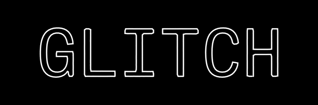

# Glitch Typography

- Type@Cooper Public Workshop Summer 2021
- 6:00–9:00pm EDT, 4 Mondays in June
- Instructors: [Lynne Yun](https://lynneyun.com), [Kevin Yeh](http://kevbk.com)
- Course Discussion: Slack

## Course Description

In our modern world, the ‘glitch’ can be found everywhere.  The idea of the ‘glitch’ as art is ripe with history that has involved experimentation in a myriad of forms. Meanwhile, the proliferation of new tools and frameworks to aid in visual coding on the web has become easier than ever, opening the doors for creatives to explore the space of font structures and layouts in new and radical ways. 

This area of experimentation seems ripe for creatives wanting to explore the concepts of glitch aesthetics and data bending. What if a letterform could be affected by sound? What happens when you manipulate the raw components of a font? What new ideas can we gain from breaking away from pixel-perfect intentionality?

P5.js will be the main programming library for the course, a beginner-friendly Javascript framework. Students who are new to programming are welcome. Techniques covered in this course will include building visual compositions with code, manipulating pixel and vector data, and implementing them in real-time applications on the browser.

During the course of four evenings, there will be weekly lectures and demonstrations on different algorithmic concepts. Students will be expected to complete weekly assignments to solidify their understanding and create typographic projects of a computational nature. 

## Course Outline 

|Week|Topic| Sketch Links |Assignments
|-----|----|-----------|------
|1|[Introductions, Overview, and Conceptualizing Programs](#section-1-overview-and-conceptualizing-programs)|[Sketches](https://editor.p5js.org/kyeah/collections/1_JEsYCEw)   [Class Tutorial](tutorials/1-programs-js-and-p5.md)|Interactive piece   + Video Tutorials
|2|[Hello Glitch!](#section-2-intro-to-glitch)|[Sketches (loops and grid)](https://editor.p5js.org/kyeah/collections/M93qYCeRI)   [Live Class Examples](https://editor.p5js.org/kyeah/collections/CpANdGy6n)   [Class Tutorial](tutorials/2-grids-and-automation.md)| 
|3|Diving Deeper into p5.js| | 
|4|Mini Project Presentation + TBD| |

## Topic Sections

## Section 0: Before the First Week
- Make an account for the [P5.js Web Editor](https://editor.p5js.org/)
- Join the Generative Type Slack 

## Section 1: Overview and Conceptualizing Programs

Class materials: Grid paper

- 👋 Roundtable Intros & Housekeeping
- "Talking to Machines" Lecture
- Type as Machine-Readable Data Thought Exercise

*~ Break ~*

- What is a Program?
- How Do I JavaScript?
- Anatomy of a p5.js sketch

Visual References: 

- [5 Core Programming Concepts](img/programming-blocks.png)
- [Milk and Avocados](img/milk-and-avocados.png)

## ✏️ Week 1 Homework

### Assignment
* (beginner) Make an interactive brush tool
* (intermediate+) Make a mini drawing program. Think about how people could swap between different kinds of brushes, change canvas color, etc.

### Watch Video Tutorials

* [Errors & Console by Coding Train (6 mins)](https://youtu.be/LuGsp5KeJMM)
* [Code Comments by Coding Train (6 mins)](https://youtu.be/xJcrPJuem5Q)

### (Optional Video Tutorials for Beginners)

* [Shapes & Drawing by Coding Train](https://youtu.be/c3TeLi6Ns1E)
* [Color by Coding Train](https://youtu.be/riiJTF5-N7c)
* [Variables in p5.js(mouseX, mouseY) by Coding Train](https://www.youtube.com/watch?v=RnS0YNuLfQQ&list=PLRqwX-V7Uu6Zy51Q-x9tMWIv9cueOFTFA&t=0s)
* [The random() Function by Coding Train](https://youtu.be/nfmV2kuQKwA)

## Section 2: Intro to Glitch
## ✏️ Week 2 Homework

### Assignment
* Create a sketch that's inspired by 'Glitch' (Recommend going through the readings below beforehand)

### Reading

* [FastCo: Inside The Bizarre Phenomenon Known As “Glitch Art”](https://www.fastcompany.com/3034296/inside-the-bizarre-phenomenon-known-as-glitch-art#:~:text=International%20artists%20that%20tinker%20heavily,D%20installation%2C%20or%20computer%20screen.)
* [Glitch Aesthetics](https://loriemerson.net/2014/10/01/glitch-aesthetics/) by loriemerson

### (Optional Video Tutorials for Beginners)
Watch these video series by Coding Train (Daniel Shiffman)

* [Else & Else if](https://www.youtube.com/watch?v=r2S7j54I68c&list=PLRqwX-V7Uu6Zy51Q-x9tMWIv9cueOFTFA&index=17) 
* [Boolean Variables](https://www.youtube.com/watch?v=Rk-_syQluvc&list=PLRqwX-V7Uu6Zy51Q-x9tMWIv9cueOFTFA&index=18)
* [While and For Loops](https://www.youtube.com/watch?v=cnRD9o6odjk&list=PLRqwX-V7Uu6Zy51Q-x9tMWIv9cueOFTFA&index=19) *highly recommend
* [Nested For Loops](https://www.youtube.com/watch?v=1c1_TMdf8b8&list=PLRqwX-V7Uu6Zy51Q-x9tMWIv9cueOFTFA&index=20) *highly recommend

## Section 3: Diving Deeper into p5.js
## ✏️ Week 3 Homework

### Assignment
* (beginner): Create a sketch based off the demo sketch(es)
* (intermediate+): Create a sketch utilizing a dataset (recommend grabbing one from [Corpora](https://github.com/dariusk/corpora))

### (Optional Video Tutorials for Beginners)
Watch these video series by Coding Train (Daniel Shiffman)

* [What is an Array?](https://www.youtube.com/watch?v=VIQoUghHSxU&t=1s) 
* [Arrays and Loops](https://www.youtube.com/watch?v=RXWO3mFuW-I)
* [Arrays of Objects](https://www.youtube.com/watch?v=fBqaA7zRO58&t=2s) 

## 📚 General Resources

### p5.js tutorials:

**Video-based:** p5.js basics with Coding Train (Dan Shiffman): 
[Code! Programming with p5.js](https://www.youtube.com/playlist?list=PLRqwX-V7Uu6Zy51Q-x9tMWIv9cueOFTFA)

**Text-based:** tutorials via Allison Parrish
* [First Steps](https://creative-coding.decontextualize.com/first-steps/)
* [Text and Type](https://creative-coding.decontextualize.com/text-and-type/)

**Official Documentation:**
* [p5js.org/learn](https://p5js.org/learn/)

### Practical Javascript:

* [Javascript in the browser console](https://creative-coding.decontextualize.com/browser-console/)
* [Expressions, Variables, and Loops](https://creative-coding.decontextualize.com/expressions-variables-and-loops/)

### Programming: 
(for those who like to learn conceptually)
  
* [Just Javascript](https://justjavascript.com/) - super accessible, visual newsletter by Dan Abramov and Maggie Appleton.
* [Eloquent Javascript](https://eloquentjavascript.net/00_intro.html) (Chapters 0-2) - In-depth walkthrough of JavaScript.

### Additional Resources
* [Generative Design (Book + Advanced Sketch Examples)](http://www.generative-gestaltung.de/2/)
